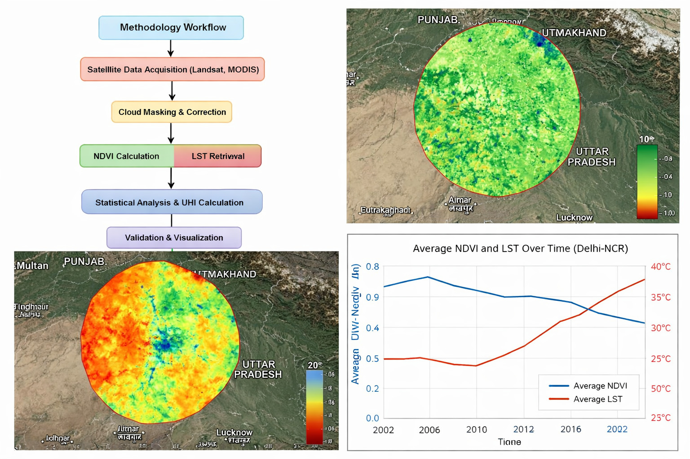

# 🌍 Multi-Decadal Spatio-Temporal Dynamics & Predictive Modelling of Urban Heat Island (UHI) Intensity: Delhi-NCR (1995–2045)

  

  <strong>fig1.jpg — Project Overview / Research Cover</strong>

  <strong>Earth Observation • Remote Sensing • GIS • Google Earth Engine • Python • Machine Learning • Climate & Urban Analytics</strong>

  
  
  
  
  
  
  

---

# 🛰️ SCI Journal Title

**Spatio-Temporal Analysis and Machine Learning-Based Prediction of Urban Heat Island Intensity over Delhi-NCR Region Using Multi-Temporal Landsat and ESA WorldCover**

---

# 📌 Project Overview

This research investigates the **multi-decadal evolution, spatial distribution, controlling factors, hotspot formation, and future projection of Urban Heat Island (UHI) intensity over Delhi-NCR** using multi-source Earth Observation data, Remote Sensing, GIS, Google Earth Engine, Python, statistical modelling, and Machine Learning.

The study covers:

- **Historical analysis:** 1995–2025
- **Future projection:** 2025–2045
- **Total research horizon:** 1995–2045
- **Study centre:** 28.6139° N, 77.2090° E
- **Approximate AOI:** 150 km buffer
- **Primary variables:** LST, NDVI, NDBI, NDWI, emissivity and land-cover classes
- **Satellite datasets:** Landsat 5/7/8/9 and MODIS
- **Land-cover dataset:** ESA WorldCover
- **Elevation:** SRTM
- **Processing:** Google Earth Engine + Python
- **Machine Learning:** Linear Regression, Random Forest, Gradient Boosting and LSTM
- **Analysis:** Spatial, temporal, statistical, hotspot, correlation, regression and predictive analysis

  

  <strong>fig2.jpg — Integrated Conceptual Research Framework</strong>

---

# 🔭 Research Vision

The central objective is to develop an integrated Earth Observation and Machine Learning framework capable of explaining:

**How Delhi-NCR has thermally transformed since 1995, which land-surface and environmental factors are responsible for this transformation, where UHI hotspots are concentrated, and how the thermal environment may evolve toward 2045 under changing urban conditions.**

The project integrates:

**Satellite Observations → Spectral Indices → Land Surface Temperature → UHI Intensity → Spatial Statistics → Machine Learning → Future Projection → Urban Climate Interpretation**

---

# 📊 Project Metadata

| Parameter | Description |
|---|---|
| Project Title | Multi-Decadal Spatio-Temporal Dynamics & Predictive Modelling of Urban Heat Island (UHI) Intensity: Delhi-NCR (1995–2045)[span_3](start_span)[span_3](end_span) |
| SCI Journal Title | Spatio-Temporal Analysis and Machine Learning-Based Prediction of Urban Heat Island Intensity over Delhi-NCR Region Using Multi-Temporal Landsat and ESA WorldCover[span_4](start_span)[span_4](end_span) |
| Organization | ESARC — Earth & Space Applications Research Centre[span_5](start_span)[span_5](end_span) |
| Study Region | Delhi-NCR and surrounding region[span_6](start_span)[span_6](end_span) |
| Study Centre | 28.6139° N, 77.2090° E[span_7](start_span)[span_7](end_span) |
| Approximate AOI | 150 km buffer[span_8](start_span)[span_8](end_span) |
| Historical Period | 1995–2025[span_9](start_span)[span_9](end_span) |
| Future Projection | 2025–2045[span_10](start_span)[span_10](end_span) |
| Total Research Period | 1995–2045[span_11](start_span)[span_11](end_span) |
| Primary Satellite | Landsat 5/7/8/9[span_12](start_span)[span_12](end_span) |
| Supporting Satellite | MODIS[span_13](start_span)[span_13](end_span) |
| Land Cover | ESA WorldCover[span_14](start_span)[span_14](end_span) |
| DEM | SRTM[span_15](start_span)[span_15](end_span) |
| Processing Platform | Google Earth Engine[span_16](start_span)[span_16](end_span) |
| Programming | Python[span_17](start_span)[span_17](end_span) |
| GIS | QGIS / Google Earth Engine[span_18](start_span)[span_18](end_span) |
| Statistical Analysis | Correlation, Regression, Trend Analysis[span_19](start_span)[span_19](end_span) |
| ML Models | Linear Regression, Random Forest, Gradient Boosting, LSTM[span_20](start_span)[span_20](end_span) |
| Major Output | Historical UHI reconstruction + predictive modelling[span_21](start_span)[span_21](end_span) |
| Research Organisation | ESARC[span_22](start_span)[span_22](end_span) |

---

# 📝 Abstract

Urban Heat Island (UHI) represents one of the major environmental consequences of rapid urbanisation, land-cover transformation, vegetation loss, surface sealing and anthropogenic development.

Delhi-NCR has experienced substantial demographic, infrastructural and land-use transformation during the last several decades. Such changes can modify surface energy balance and consequently influence Land Surface Temperature (LST) and spatial UHI patterns.

This research develops a multi-decadal Earth Observation framework for analysing UHI dynamics across Delhi-NCR from **1995 to 2045**.

The historical component covers **1995–2025** using multi-temporal Landsat observations supported by MODIS, ESA WorldCover, SRTM and additional environmental datasets. LST is derived from satellite thermal observations, while NDVI, NDBI and NDWI are calculated to quantify vegetation, built-up intensity and surface-water conditions.

The study investigates relationships between:

- Urbanisation
- Vegetation
- Surface water
- Land-cover transformation
- Surface emissivity
- Land Surface Temperature
- UHI intensity

Statistical and Machine Learning models are subsequently applied to identify nonlinear relationships and develop predictive frameworks for future thermal conditions.

The future component extends the analysis toward **2045** using scenario-based predictive modelling.

The final research framework is intended to provide a reproducible methodology for:

- Multi-decadal UHI analysis
- Urban thermal hotspot detection
- Land-cover and thermal interaction analysis
- Satellite-based environmental monitoring
- Machine Learning-based prediction
- Urban climate assessment
- Future thermal-risk interpretation

---

# ⚠️ Scientific Declaration

The **1995–2025 period represents historical Earth Observation-based analysis**, while the **2025–2045 period represents modelled future projection/scenario analysis**.

Projected values are not direct satellite observations.

All future estimates must therefore be reported as:

> **Modelled / projected values under defined assumptions and scenarios**

and not as observed future temperatures.

---

# 🌆 Background & Rationale

Rapid urbanisation modifies the physical characteristics of the land surface.

Common urban transformations include:

- Conversion of vegetation into built-up surfaces
- Increase in impervious surfaces
- Reduction in exposed soil and agricultural land
- Fragmentation of water bodies
- Increase in building density
- Road-network expansion
- Industrial development
- Reduction in evapotranspiration
- Modification of surface albedo
- Modification of thermal emissivity
- Increased anthropogenic heat release

These processes influence the surface energy balance.

A simplified conceptual relationship is:

**Urbanisation → Land-Cover Change → Surface Properties → Energy Balance → LST → UHI**

---

# ❓ Research Problem

The research addresses the following broad problem:

> How has the spatial and temporal behaviour of Urban Heat Island intensity changed across Delhi-NCR between 1995 and 2025, what environmental and land-surface factors explain these changes, and how can Machine Learning be used to project possible UHI behaviour toward 2045?

---

# 🧪 Research Hypotheses

### H1 — Urbanisation Hypothesis

Increasing built-up intensity represented by NDBI is associated with increasing LST and UHI intensity.

### H2 — Vegetation Cooling Hypothesis

Increasing vegetation represented by NDVI is associated with lower LST and reduced UHI intensity.

### H3 — Water-Body Cooling Hypothesis

Higher surface-water presence represented by NDWI is associated with comparatively lower LST.

---

# ❓ Research Questions

### RQ1
How has LST changed across Delhi-NCR between 1995 and 2025?

### RQ2
How has UHI intensity changed spatially and temporally?

### RQ3
Which areas represent persistent thermal hotspots?

### RQ4
How strongly is NDVI related to LST?

### RQ5
How strongly is NDBI related to LST?

### RQ6
How does NDWI influence local thermal conditions?

### RQ7
How has land-cover transformation contributed to UHI development?

### RQ8
Which Machine Learning model provides the most reliable predictive performance under the selected validation framework?

### RQ9
What thermal conditions may develop toward 2045 under the defined scenarios?

### RQ10
How can Earth Observation-based UHI information support future urban environmental planning?

---

# 🎯 Research Objectives

1. Develop a consistent multi-decadal satellite-based UHI dataset.
2. Estimate historical LST across Delhi-NCR.
3. Derive NDVI, NDBI and NDWI.
4. Analyse land-cover transformation.
5. Quantify relationships between land-cover variables and LST.
6. Identify spatial UHI hotspots.
7. Analyse long-term thermal trends.
8. Develop statistical prediction models.
9. Develop Machine Learning prediction models.
10. Validate model performance.
11. Estimate future thermal behaviour toward 2045.
12. Develop reproducible research workflows.
13. Produce publication-quality figures and maps.
14. Establish a framework suitable for future updates.

---

# 🗺️ Study Area

  

  <strong>fig3.jpg — Delhi-NCR Study Area and 150 km AOI</strong>

The research focuses on the Delhi-NCR region and surrounding areas using an approximate **150 km buffer** around the study centre:

**28.6139° N, 77.2090° E**

The larger buffer is used to provide regional environmental context and enable comparison between:

- Dense urban areas
- Peri-urban zones
- Agricultural regions
- Forest/vegetated areas
- Water bodies
- Industrial areas
- Rural surroundings

### Spatial Concept

<pre><code>
                    Regional Study Area
                           │
                           ▼
                  ┌─────────────────┐
                  │    Delhi-NCR    │
                  │      Core       │
                  └────────┬────────┘
                           │
             ┌─────────────┼─────────────┐
             ▼             ▼             ▼
        Urban Core     Peri-Urban     Rural Zone
             │             │             │
             └─────────────┼─────────────┘
                           ▼
                    150 km AOI
                           │
                           ▼
                Regional Environmental
                       Context
</code></pre>

---

# 🛰️ Data Sources

  

  <strong>fig4.jpg — Multi-Temporal Satellite Data Strategy</strong>

| Dataset | Application |
|---|---|
| Landsat 5 TM | Historical LST and spectral analysis |
| Landsat 7 ETM+ | Historical LST and spectral analysis |
| Landsat 8 OLI/TIRS | LST and spectral analysis |
| Landsat 9 OLI-2/TIRS-2 | Recent LST and spectral analysis |
| MODIS | Temporal thermal support and validation |
| ESA WorldCover | Land-cover classification |
| SRTM | Elevation and terrain variables |
| Administrative Boundaries | Spatial reporting |
| Meteorological Data | Validation where available |
| Additional EO datasets | Supporting environmental analysis |

---

# 🛰️ Landsat Data Strategy

The historical satellite strategy uses appropriate Landsat missions according to sensor availability.

### Historical Sensor Sequence

<pre><code>
1995 ─────────────── 2011 ─────── 2013 ───────── 2022 ───── 2025
 │                     │             │               │          │
 Landsat 5             Landsat 5/7   Landsat 8       Landsat 9  Latest
 │                     │             │               │          │
 └──────── Historical Multi-Sensor Earth Observation ──────────┘
</code></pre>

Cross-sensor differences must be considered during long-term analysis.

A consistent methodology should therefore be applied wherever possible for:

- Cloud masking
- Atmospheric correction
- Thermal calibration
- Scaling
- Emissivity estimation
- Spatial aggregation
- Temporal compositing

---

# 🌿 Spectral Indices

## NDVI — Normalized Difference Vegetation Index

NDVI is used as a vegetation indicator.

**Formula:**

`NDVI = (NIR - RED) / (NIR + RED)`

Higher NDVI generally indicates stronger vegetation presence.

---

## 🏙️ NDBI — Normalized Difference Built-up Index

NDBI is used as an indicator of built-up intensity.

**Formula:**

`NDBI = (SWIR - NIR) / (SWIR + NIR)`

Higher NDBI generally indicates stronger built-up characteristics.

---

## 💧 NDWI — Normalized Difference Water Index

NDWI is used to identify surface-water-related conditions.

**Formula:**

`NDWI = (GREEN - NIR) / (GREEN + NIR)`

---

# 🌡️ Land Surface Temperature Methodology

The LST processing chain generally follows:

**Thermal Digital Number / Radiance → Brightness Temperature → NDVI → Vegetation Proportion → Emissivity → Land Surface Temperature**

---

# 🌱 Vegetation Proportion

A commonly used formulation is:

`Pv = ((NDVI - NDVImin) / (NDVImax - NDVImin))²`

where:

- `Pv` = vegetation proportion
- `NDVImin` = minimum NDVI within the selected range
- `NDVImax` = maximum NDVI within the selected range

---

# 🔥 Surface Emissivity

An emissivity approximation can be calculated using vegetation proportion:

`ε = 0.004 × Pv + 0.986`

The exact emissivity approach should be adapted to:

- Sensor
- Land-cover condition
- Available thermal bands
- Research objective
- Validation requirements

---

# 🌡️ LST Scaling

For a generic scaled thermal product:

`LST(K) = DN × Scale Factor + Offset`

Conversion to Celsius:

`LST(°C) = LST(K) - 273.15`

The exact scale factor and offset must be taken from the metadata of the specific Earth Engine dataset being used.

---

# 🧠 Integrated Conceptual Framework

<pre><code>
              SATELLITE OBSERVATIONS
                       │
        ┌──────────────┼──────────────┐
        ▼              ▼              ▼
      Landsat         MODIS       Supporting EO
        │              │              │
        └──────────────┼──────────────┘
                       ▼
                 PREPROCESSING
                       │
          ┌────────────┼────────────┐
          ▼            ▼            ▼
         LST          NDVI         NDBI
          │            │            │
          └────────────┼────────────┘
                       ▼
                     NDWI
                       │
                       ▼
              LAND-COVER ANALYSIS
                       │
                       ▼
                  UHI ANALYSIS
                       │
        ┌──────────────┼──────────────┐
        ▼              ▼              ▼
   Trend Analysis   Hotspots      Correlation
        │              │              │
        └──────────────┼──────────────┘
                       ▼
             MACHINE LEARNING
                       │
        ┌──────────────┼──────────────┐
        ▼              ▼              ▼
    Regression      RF / GBM         LSTM
        │              │              │
        └──────────────┼──────────────┘
                       ▼
                MODEL VALIDATION
                       │
                       ▼
              FUTURE PROJECTION
                       │
                       ▼
                     2045
</code></pre>

---

# 📚 Four-Phase Research Log

## Phase 1 — Data Preparation

- Define AOI
- Collect datasets
- Verify temporal coverage
- Apply cloud masking
- Standardise datasets
- Create annual/seasonal composites
- Generate quality-control layers

## Phase 2 — Historical Analysis

- LST generation
- NDVI generation
- NDBI generation
- NDWI generation
- Land-cover analysis
- UHI intensity calculation
- Hotspot analysis
- Temporal trend analysis

## Phase 3 — Statistical & ML Modelling

- Correlation analysis
- Regression analysis
- Feature engineering
- Training/validation split
- Random Forest
- Gradient Boosting
- LSTM
- Performance comparison
- Error analysis

## Phase 4 — Future Projection

- Scenario development
- Predictor generation
- Model application
- 2045 projection
- Uncertainty assessment
- Spatial interpretation
- Research conclusions

---

# 🔄 Methodology Workflow

<pre><code>
START
  │
  ▼
Define Research Questions
  │
  ▼
Define AOI
  │
  ▼
Acquire Satellite & Supporting Data
  │
  ▼
Preprocess & Quality Control
  │
  ▼
Generate LST / NDVI / NDBI / NDWI
  │
  ▼
Land-Cover Analysis
  │
  ▼
Historical UHI Analysis
  │
  ▼
Trend + Correlation + Regression
  │
  ▼
Feature Engineering
  │
  ▼
Machine Learning
  │
  ▼
Validation + Error Analysis
  │
  ▼
Scenario Development
  │
  ▼
2045 Projection
  │
  ▼
Uncertainty & Interpretation
  │
  ▼
Final Research Outputs
</code></pre>

---

# 💻 Google Earth Engine Processing

The following workflow represents the general processing concept.

<pre><code class="language-javascript">
// ============================================================
// DELHI-NCR UHI RESEARCH
// Landsat-based LST / NDVI / NDBI / NDWI workflow
// ============================================================

var center = ee.Geometry.Point([77.2090, 28.6139]);

var aoi = center.buffer(150000);

Map.centerObject(aoi, 8);

var landsat8 = ee.ImageCollection('LANDSAT/LC08/C02/T1_L2')
  .filterBounds(aoi)
  .filterDate('2015-01-01', '2025-12-31')
  .filter(ee.Filter.lt('CLOUD_COVER', 30));

function maskLandsat(image) {

  var qa = image.select('QA_PIXEL');

  var cloudShadowBitMask = 1 << 4;
  var cloudBitMask = 1 << 3;

  var mask = qa.bitwiseAnd(cloudShadowBitMask).eq(0)
    .and(qa.bitwiseAnd(cloudBitMask).eq(0));

  return image.updateMask(mask);
}

function addIndices(image) {

  var ndvi = image.normalizedDifference(
    ['SR_B5', 'SR_B4']
  ).rename('NDVI');

  var ndbi = image.normalizedDifference(
    ['SR_B6', 'SR_B5']
  ).rename('NDBI');

  var ndwi = image.normalizedDifference(
    ['SR_B3', 'SR_B5']
  ).rename('NDWI');

  return image
    .addBands(ndvi)
    .addBands(ndbi)
    .addBands(ndwi);
}

var processed = landsat8
  .map(maskLandsat)
  .map(addIndices);

var composite = processed.median().clip(aoi);

Map.addLayer(
  composite.select('NDVI'),
  {min: -0.2, max: 0.8},
  'NDVI'
);

Map.addLayer(
  composite.select('NDBI'),
  {min: -0.5, max: 0.5},
  'NDBI'
);

Map.addLayer(
  composite.select('NDWI'),
  {min: -0.5, max: 0.5},
  'NDWI'
);
</code></pre>

---

# 🌡️ LST Processing Chain

<pre><code>
Satellite Thermal Band
        │
        ▼
Radiometric Calibration
        │
        ▼
Brightness Temperature
        │
        ▼
NDVI Calculation
        │
        ▼
Vegetation Proportion
        │
        ▼
Surface Emissivity
        │
        ▼
Land Surface Temperature
        │
        ▼
UHI Intensity
</code></pre>

---

# 📅 Historical Analysis: 1995–2025

The historical component is divided into representative temporal snapshots and/or annual composites.

| Year | Analysis |
|---|---|
| 1995 | Historical baseline |
| 2005 | Mid-period historical condition |
| 2015 | Recent historical transition |
| 2025 | Latest historical/reference condition |

---

# 🌡️ 1995 Historical LST

  

  <strong>fig5.jpg — 1995 Historical LST</strong>

---

# 🌡️ 2005 Historical LST

  

  <strong>fig6.jpg — 2005 Historical LST</strong>

---

# 🌡️ 2015 Historical LST

  

  <strong>fig7.jpg — 2015 Historical LST</strong>

---

# 🌡️ 2025 Historical LST

  

  <strong>fig8.jpg — 2025 Historical LST</strong>

---

# 📈 Project Output Framework

The following values represent the type of output that may be generated after complete processing.

| Period | Mean LST | UHI Pattern | Dominant Drivers |
|---|---:|---|---|
| 1995 | Derived from satellite data | Historical baseline | Initial urban structure |
| 2005 | Derived from satellite data | Increasing urban influence | Built-up expansion |
| 2015 | Derived from satellite data | Stronger urban thermal contrast | Urbanisation + vegetation change |
| 2025 | Derived from satellite data | Current historical condition | Built-up density + surface properties |
| 2045 | Modelled | Projected condition | Scenario-dependent |

**Important:** Numerical values for 2045 must only be reported after model training, validation, scenario specification and uncertainty analysis.

---

# 📊 Statistical Analysis

Statistical analysis includes:

- Descriptive statistics
- Mean
- Median
- Minimum
- Maximum
- Standard deviation
- Percentiles
- Temporal trend
- Spatial variability
- Pearson correlation
- Spearman correlation where appropriate
- Linear regression
- Residual analysis

### Example Regression

`LST = β0 + β1(NDVI) + β2(NDBI) + β3(NDWI) + ε`

where:

- `β0` = intercept
- `β1, β2, β3` = regression coefficients
- `ε` = residual/error term

---

# 🤖 Machine Learning Framework

Machine Learning is used to model relationships between environmental predictors and LST/UHI.

Potential models include:

### 1. Linear Regression

Provides an interpretable baseline.

### 2. Random Forest

Useful for nonlinear relationships and feature-importance analysis.

### 3. Gradient Boosting

Useful for modelling complex nonlinear relationships.

### 4. LSTM

Potentially useful for temporal sequences where sufficiently long, consistent time-series data are available.

---

# 🔥 UHI Hotspot Detection

  

  <strong>fig9.jpg — UHI Hotspot Detection</strong>

Hotspot analysis can identify:

- Persistent high-temperature areas
- Newly emerging hotspots
- Seasonal hotspots
- Urban-core hotspots
- Industrial hotspots
- Peri-urban transition zones

Possible methods include:

- LST threshold analysis
- Relative UHI intensity
- Z-score based hotspot analysis
- Local spatial statistics
- Getis-Ord Gi*
- Moran's I
- Temporal persistence analysis

---

# 📊 Model Performance

Model performance should be assessed using independent validation data wherever possible.

Potential metrics include:

| Metric | Purpose |
|---|---|
| R² | Explained variance |
| RMSE | Root Mean Square Error |
| MAE | Mean Absolute Error |
| MAPE | Percentage error where appropriate |
| Bias | Systematic error |
| Residual distribution | Error structure |
| Spatial validation | Geographic robustness |
| Temporal validation | Time-series robustness |

No model should be declared superior solely on training performance.

---

# 🧠 Predictive Modelling

  

  <strong>fig10.jpg — Machine Learning / Predictive Modelling</strong>

The predictive framework follows:

<pre><code>
Historical EO Dataset
        │
        ▼
Feature Engineering
        │
        ├── NDVI
        ├── NDBI
        ├── NDWI
        ├── Elevation
        ├── Land Cover
        ├── LST
        └── Temporal Variables
        │
        ▼
Training Dataset
        │
        ▼
ML Model
        │
        ▼
Validation Dataset
        │
        ▼
Performance Evaluation
        │
        ▼
Validated Model
        │
        ▼
Future Predictor Scenario
        │
        ▼
2045 Projection
</code></pre>

---

# 🧪 Model Validation

<pre><code>
Observed Historical Data
          │
          ▼
     Train / Test Split
          │
     ┌────┴────┐
     ▼         ▼
 Training    Validation
     │         │
     ▼         ▼
    Model → Prediction
                │
                ▼
        Observed vs Predicted
                │
       ┌────────┼────────┐
       ▼        ▼        ▼
      R²       RMSE     MAE
       │        │        │
       └────────┼────────┘
                ▼
       Error / Residual Analysis
                │
                ▼
        Model Reliability
</code></pre>

---

# 🔍 Validation & Error Analysis

Potential error sources include:

1. Sensor differences
2. Atmospheric effects
3. Cloud contamination
4. Mixed pixels
5. Thermal resolution
6. Emissivity uncertainty
7. Temporal mismatch
8. Meteorological variability
9. Land-cover classification errors
10. Model assumptions

Validation should therefore use multiple independent lines of evidence wherever possible.

---

# 🔗 Multi-Sensor Data Fusion

<pre><code>
Landsat
  │
  ├── High Spatial Resolution
  │
  ▼
Detailed LST / Spectral Analysis
  │
  ├────────────────────┐
  ▼                    ▼
MODIS                WorldCover
  │                    │
  ▼                    ▼
Temporal Support    Land Cover
  │                    │
  └─────────┬──────────┘
            ▼
          SRTM
            │
            ▼
       Elevation Context
            │
            ▼
     Integrated Dataset
            │
            ▼
       UHI Modelling
</code></pre>

---

# 🏙️ Urban Thermal Zoning

The region can be classified into thermal zones such as:

- Very Low Thermal Zone
- Low Thermal Zone
- Moderate Thermal Zone
- High Thermal Zone
- Very High Thermal Zone

Thresholds must be determined from the actual dataset and research methodology rather than arbitrarily assigning universal values.

---

# 🌿 NDVI–LST Relationship

<pre><code>
Increasing Vegetation
        │
        ▼
Higher NDVI
        │
        ▼
Higher Evapotranspiration
        │
        ▼
Reduced Surface Heating
        │
        ▼
Lower LST
        │
        ▼
Potential UHI Mitigation
</code></pre>

Correlation strength must be calculated from actual observations.

---

# 🏢 NDBI–LST Relationship

<pre><code>
Urban Expansion
      │
      ▼
Built-up Surface Increase
      │
      ▼
Higher NDBI
      │
      ▼
Modified Surface Energy Balance
      │
      ▼
Potential LST Increase
      │
      ▼
Higher UHI Intensity
</code></pre>

The relationship should be evaluated statistically rather than assumed to be identical across all locations and seasons.

---

# 💧 Water-Body Effect

Water bodies can influence local thermal conditions through:

- Evaporation
- High heat capacity
- Surface energy exchange
- Moisture availability
- Local microclimate effects

The spatial relationship between NDWI and LST can therefore be investigated to quantify the thermal influence of water bodies.

---

# 🔮 Future Projection Framework: 2025–2045

  

  <strong>fig11.jpg — 2045 Future UHI Projection</strong>

Future projection is based on the principle:

**Historical Observations → Learned Relationships → Future Predictor Scenario → Modelled Thermal Projection**

The 2045 output is therefore a **projection**, not an observation.

---

# 🔮 2045 Scenario Design

Possible scenario variables include:

### Urbanisation

- Built-up expansion
- NDBI change
- Urban density

### Vegetation

- NDVI decline
- Vegetation conservation
- Green-space expansion

### Water

- Water-body persistence
- Water-body loss
- Wetness changes

### Land Cover

- Agricultural conversion
- Built-up conversion
- Vegetation transition

Scenario assumptions must be explicitly documented.

---

# 🧬 Feature Engineering

Potential predictor variables include:

- Historical LST
- NDVI
- NDBI
- NDWI
- Land-cover class
- Elevation
- Slope
- Distance from urban core
- Distance from water bodies
- Year
- Season
- Spatial coordinates
- Historical trend
- Land-cover transition

---

# 🖼️ Principal Figure Set

The repository contains **11 principal research figures**.

| Figure | Exact File Name | Purpose |
|---|---|---|
| Figure 1 | `fig1.jpg` | Project overview / research cover |
| Figure 2 | `fig2.jpg` | Integrated conceptual research framework |
| Figure 3 | `fig3.jpg` | Delhi-NCR study area and AOI |
| Figure 4 | `fig4.jpg` | Multi-temporal satellite data strategy |
| Figure 5 | `fig5.jpg` | 1995 historical LST |
| Figure 6 | `fig6.jpg` | 2005 historical LST |
| Figure 7 | `fig7.jpg` | 2015 historical LST |
| Figure 8 | `fig8.jpg` | 2025 historical LST |
| Figure 9 | `fig9.jpg` | UHI hotspot detection |
| Figure 10 | `fig10.jpg` | Machine Learning / predictive modelling |
| Figure 11 | `fig11.jpg` | 2045 future projection |

**Principal figure range: `fig1.jpg` → `fig11.jpg`**

**No `fig12.jpg`, `fig13.jpg`, `fig14.jpg` or `fig15.jpg` are part of the defined principal figure set.**

---

# 🎬 Research Demonstrations

## 🎬 video1.mp4

**Exact file:** `video1.mp4`

[▶️ Open video1.mp4](video1.mp4)[span_23](start_span)[span_23](end_span)

**Purpose:** Google Earth Engine processing demonstration covering satellite-data preparation, filtering, preprocessing and Earth Observation workflow.

---

## 🎬 video2.mp4

**Exact file:** `video2.mp4`

[▶️ Open video2.mp4](video2.mp4)[span_24](start_span)[span_24](end_span)

**Purpose:** LST processing demonstration covering thermal-data processing and Land Surface Temperature workflow.

---

## 🎬 video3.mp4

**Exact file:** `video3.mp4`

[▶️ Open video3.mp4](video3.mp4)[span_25](start_span)[span_25](end_span)

**Purpose:** Python and Machine Learning demonstration covering data processing, statistical analysis and predictive modelling.

---

## 🎬 video4.mp4

**Exact file:** `video4.mp4`

[▶️ Open video4.mp4](video4.mp4)[span_26](start_span)[span_26](end_span)

**Purpose:** Final integrated research demonstration covering the overall research pipeline and outputs.

---

# 📁 Repository Structure

<pre><code>
UHI-Delhi-NCR-1995-2045/
│
├── README.md
│
├── fig1.jpg
├── fig2.jpg
├── fig3.jpg
├── fig4.jpg
├── fig5.jpg
├── fig6.jpg
├── fig7.jpg
├── fig8.jpg
├── fig9.jpg
├── fig10.jpg
├── fig11.jpg
│
├── video1.mp4
├── video2.mp4
├── video3.mp4
├── video4.mp4
│
├── gee/
│   ├── landsat_processing.js
│   ├── lst_processing.js
│   ├── ndvi_processing.js
│   ├── ndbi_processing.js
│   └── ndwi_processing.js
│
├── python/
│   ├── preprocessing.py
│   ├── lst_analysis.py
│   ├── statistical_analysis.py
│   ├── hotspot_analysis.py
│   ├── random_forest.py
│   ├── gradient_boosting.py
│   └── lstm_model.py
│
├── data/
│   ├── raw/
│   ├── processed/
│   └── validation/
│
├── results/
│   ├── maps/
│   ├── tables/
│   ├── statistics/
│   └── models/
│
└── documentation/
    ├── research_log.md
    ├── methodology.md
    └── validation.md
</code></pre>

---

# ♻️ Reproducibility

The research should be reproducible through:

- Clearly documented AOI
- Documented dataset IDs
- Processing dates
- Sensor information
- Cloud-mask criteria
- Scaling factors
- LST methodology
- Index formulas
- Model parameters
- Training/validation strategy
- Random seeds where appropriate
- Software versions
- Python environment
- GEE scripts
- Data-processing logs
- Validation datasets

---

# ✅ Quality Control

<pre><code>
DATA ACQUISITION
      │
      ▼
DATA QUALITY CHECK
      │
      ├── Cloud?
      ├── Missing data?
      ├── Sensor mismatch?
      ├── Temporal mismatch?
      └── Spatial mismatch?
      │
      ▼
PREPROCESSING QC
      │
      ▼
DERIVED PRODUCT QC
      │
      ├── LST
      ├── NDVI
      ├── NDBI
      └── NDWI
      │
      ▼
STATISTICAL QC
      │
      ▼
MODEL QC
      │
      ▼
FINAL VALIDATION
</code></pre>

---

# ⚠️ Limitations

1. Historical satellite availability is not perfectly uniform.
2. Different Landsat sensors have different characteristics.
3. Thermal resolution is coarser than optical spatial resolution.
4. Cloud contamination may reduce usable observations.
5. Atmospheric conditions influence thermal retrieval.
6. Emissivity estimation introduces uncertainty.
7. Satellite LST and near-surface air temperature are different variables.
8. Future projections depend strongly on scenario assumptions.
9. Machine Learning performance depends on training-data quality.
10. Long-term predictions should not be interpreted as deterministic future observations.

---

# 🛠️ Mitigation Strategies

| Limitation | Mitigation |
|---|---|
| Sensor differences | Cross-sensor consistency checks |
| Clouds | QA-based masking |
| Missing observations | Temporal compositing |
| Thermal uncertainty | Validation against independent observations |
| Emissivity | Land-cover-informed estimation |
| Model overfitting | Cross-validation |
| Temporal leakage | Time-aware validation |
| Spatial leakage | Spatial validation |
| Future uncertainty | Multiple scenarios |
| Prediction uncertainty | Error and sensitivity analysis |

---

# 🔬 Future Research

Potential future extensions include:

- Higher-frequency time-series modelling
- Sentinel-2 integration
- ECOSTRESS integration
- ERA5-Land integration
- ERA5 meteorological variables
- Night-time thermal analysis
- Urban morphology
- Building-height data
- Population density
- Traffic-related variables
- Anthropogenic heat
- Energy consumption
- Climate-model integration
- Explainable AI
- Causal modelling
- Urban digital twins
- Near-real-time UHI monitoring

---

# 🤖 Explainable AI

Machine Learning predictions should be interpretable whenever possible.

Potential explainability methods include:

- Feature importance
- Permutation importance
- Partial Dependence
- SHAP
- Local explanations
- Spatial feature importance

### Explainable AI Framework

<pre><code>
ML Prediction
     │
     ▼
Explainability Layer
     │
 ┌───┼────────────┐
 ▼   ▼            ▼
SHAP Feature     Partial
     Importance   Dependence
     │
     ▼
Environmental Interpretation
     │
     ▼
Urban Climate Understanding
</code></pre>

---

# 📚 References

Major methodological references should include authoritative literature and official dataset documentation covering:

- Landsat Collection 2
- NASA Earth Observation
- USGS Landsat
- MODIS
- ESA WorldCover
- SRTM
- Land Surface Temperature retrieval
- NDVI
- NDBI
- NDWI
- Urban Heat Island science
- Remote Sensing
- GIS
- Machine Learning
- Random Forest
- Gradient Boosting
- LSTM
- Explainable AI

Dataset versions, access dates and DOI information should be recorded in the final research manuscript.

---

# 🧪 Research Quality Principles

The research follows these principles:

### 1. Reproducibility

Every major processing step should be documented.

### 2. Transparency

Assumptions must be clearly stated.

### 3. Scientific Separation

Observed, derived and modelled products must not be mixed.

### 4. Validation

Predictions must be independently evaluated.

### 5. Uncertainty

Uncertainty should be quantified wherever possible.

### 6. Consistency

Multi-temporal datasets should use consistent processing.

### 7. Traceability

Every major result should be traceable to its source data and processing workflow.

---

# 🔎 Important Scientific Distinction

The project uses four distinct categories:

| Category | Meaning |
|---|---|
| Observed | Directly measured satellite/environmental observation |
| Derived | Product calculated from observations |
| Modelled | Output generated by statistical/ML model |
| Projected | Modelled future estimate under specified assumptions |

### Example

**Landsat thermal observation → Observed**

**Calculated LST → Derived**

**Random Forest prediction → Modelled**

**2045 UHI estimate → Projected**

This distinction is essential for scientific reporting.

---

# 📡 Recommended Final Validation Data

Where available, the following independent datasets can strengthen validation:

- Meteorological station temperature
- Surface weather observations
- MODIS LST
- ERA5-Land
- ECOSTRESS
- Independent Landsat observations
- Urban land-cover datasets
- Ground observations

Validation datasets should be temporally and spatially matched to the satellite observations.

---

# 🔬 Integrated Research Pipeline

<pre><code>
                 ┌─────────────────────┐
                 │ Satellite Archives  │
                 └──────────┬──────────┘
                            │
                            ▼
                 ┌─────────────────────┐
                 │ Preprocessing & QC  │
                 └──────────┬──────────┘
                            │
                            ▼
        ┌─────────────────────────────────────┐
        │                                     │
        ▼                                     ▼
      LST                                    Indices
        │                              ┌──────┼──────┐
        │                              ▼      ▼      ▼
        │                            NDVI   NDBI   NDWI
        │                              │      │      │
        └──────────────────────────────┼──────┼──────┘
                                       ▼
                              Land-Cover Analysis
                                       │
                                       ▼
                              Historical UHI
                                       │
                    ┌──────────────────┼──────────────────┐
                    ▼                  ▼                  ▼
                 Trends            Hotspots          Statistics
                    │                  │                  │
                    └──────────────────┼──────────────────┘
                                       ▼
                                Feature Engineering
                                       │
                                       ▼
                              Machine Learning
                                       │
                                       ▼
                                  Validation
                                       │
                                       ▼
                              Scenario Modelling
                                       │
                                       ▼
                                   2045 UHI
                                       │
                                       ▼
                              Interpretation
                                       │
                                       ▼
                              Final Research
</code></pre>

---

# 🗓️ Project Milestones

| Phase | Major Milestone |
|---|---|
| Phase 1 | AOI and data architecture |
| Phase 2 | Satellite preprocessing |
| Phase 3 | LST generation |
| Phase 4 | NDVI/NDBI/NDWI generation |
| Phase 5 | Historical UHI analysis |
| Phase 6 | Statistical analysis |
| Phase 7 | Hotspot analysis |
| Phase 8 | Machine Learning |
| Phase 9 | Model validation |
| Phase 10 | Future scenario development |
| Phase 11 | 2045 projection |
| Phase 12 | Final research documentation |

---

# 💻 Technology Stack

<pre><code>
Earth Observation
      │
      ├── Landsat
      ├── MODIS
      ├── ESA WorldCover
      └── SRTM
      │
      ▼
Google Earth Engine
      │
      ├── Image Processing
      ├── Cloud Masking
      ├── Compositing
      ├── Spectral Indices
      └── LST Processing
      │
      ▼
Python
      │
      ├── NumPy
      ├── Pandas
      ├── Matplotlib
      ├── Scikit-learn
      └── TensorFlow / Keras
      │
      ▼
GIS
      │
      ├── QGIS
      └── Spatial Analysis
      │
      ▼
Machine Learning
      │
      ├── Linear Regression
      ├── Random Forest
      ├── Gradient Boosting
      └── LSTM
</code></pre>

---

# 🔑 Keywords

`Urban Heat Island`

`UHI`

`Delhi-NCR`

`Land Surface Temperature`

`LST`

`Remote Sensing`

`Earth Observation`

`Landsat`

`MODIS`

`ESA WorldCover`

`SRTM`

`NDVI`

`NDBI`

`NDWI`

`Google Earth Engine`

`Python`

`GIS`

`Machine Learning`

`Random Forest`

`Gradient Boosting`

`LSTM`

`Spatio-Temporal Analysis`

`Urban Climate`

`Climate Change`

`Predictive Modelling`

`Hotspot Analysis`

`Environmental Monitoring`

---

# 🛰️ Research Organisation

## ESARC — Earth & Space Applications Research Centre

The project is developed under the research framework of:

**ESARC — Earth & Space Applications Research Centre**

Research domains include:

- Earth Observation
- Remote Sensing
- GIS
- Urban Environmental Monitoring
- Climate Applications
- Satellite Data Analysis
- Space Science Applications
- Machine Learning
- Environmental Modelling

---

# 📜 License

This repository is intended for educational, research and scientific-development purposes.

Users should appropriately acknowledge:

- Original satellite-data providers
- Dataset providers
- Scientific publications
- Open-source software
- External datasets
- Supporting research institutions

Any redistribution of datasets must comply with the respective dataset licensing and usage conditions.

---

# 📖 Citation

If this research framework, methodology or derived outputs are used in academic work, please cite the project appropriately.

<pre><code>
Chaudhari, A.
"Multi-Decadal Spatio-Temporal Dynamics & Predictive Modelling
of Urban Heat Island (UHI) Intensity: Delhi-NCR (1995–2045)."

ESARC — Earth & Space Applications Research Centre.
</code></pre>

---

# 📔 Research Log

<pre><code>
Project:
Multi-Decadal Spatio-Temporal Dynamics & Predictive Modelling
of Urban Heat Island (UHI) Intensity: Delhi-NCR (1995–2045)

Historical Period:
1995–2025

Future Projection:
2025–2045

Study Centre:
28.6139° N, 77.2090° E

Approximate AOI:
150 km buffer

Primary Data:
Landsat 5/7/8/9

Supporting Data:
MODIS
ESA WorldCover
SRTM
Administrative Boundaries
Meteorological Validation Data

Primary Variables:
LST
NDVI
NDBI
NDWI
Emissivity
Land Cover

Processing:
Google Earth Engine
Python
GIS

Machine Learning:
Linear Regression
Random Forest
Gradient Boosting
LSTM

Principal Figures:
fig1.jpg
fig2.jpg
fig3.jpg
fig4.jpg
fig5.jpg
fig6.jpg
fig7.jpg
fig8.jpg
fig9.jpg
fig10.jpg
fig11.jpg

Research Demonstrations:
video1.mp4
video2.mp4
video3.mp4
video4.mp4

Primary Outputs:
Historical LST
UHI Intensity
Thermal Hotspots
Land-Cover Relationships
Statistical Models
ML Models
2045 Projection
Uncertainty Analysis

Organisation:
ESARC
Earth & Space Applications Research Centre
</code></pre>

---

# 🌍 Data & Ethics

This project is based primarily on Earth Observation and environmental datasets.

The research should:

- Respect dataset licensing.
- Provide appropriate attribution.
- Avoid misrepresenting modelled values as observations.
- Clearly disclose assumptions.
- Report uncertainty.
- Avoid unsupported claims.
- Preserve scientific reproducibility.
- Distinguish correlation from causation.
- Document processing decisions.

---

# 🚀 Future Development Roadmap

<pre><code>
                    CURRENT RESEARCH
                           │
                           ▼
                  Historical UHI
                    1995–2025
                           │
                           ▼
                 Statistical Analysis
                           │
                           ▼
                Machine Learning Models
                           │
                           ▼
                   Model Validation
                           │
                           ▼
                 Scenario Development
                           │
                           ▼
                    2045 Projection
                           │
                           ▼
                Uncertainty Assessment
                           │
                           ▼
                Explainable AI / SHAP
                           │
                           ▼
              Multi-Sensor Data Fusion
                           │
                           ▼
             Higher-Resolution Urban Data
                           │
                           ▼
                 Urban Climate System
                           │
                           ▼
                 Long-Term Monitoring
</code></pre>

---

# 🌌 Final Research Vision

The ultimate goal of this project is to establish a **reproducible, multi-sensor, multi-decadal Earth Observation and Machine Learning framework** for understanding urban thermal transformation across Delhi-NCR.

The research integrates:

**Satellite Remote Sensing**

+

**Land Surface Temperature**

+

**Vegetation Dynamics**

+

**Built-up Expansion**

+

**Surface Water**

+

**Land-Cover Change**

+

**GIS & Spatial Statistics**

+

**Machine Learning**

+

**Future Scenario Modelling**

to develop a comprehensive understanding of urban thermal dynamics.

---

# 🧩 Project Summary

<pre><code>
                 ┌──────────────────────────┐
                 │       DELHI-NCR          │
                 │       1995–2045          │
                 └────────────┬─────────────┘
                              │
          ┌───────────────────┼───────────────────┐
          │                   │                   │
          ▼                   ▼                   ▼
       SATELLITE             GIS                PYTHON
          │                   │                   │
          ▼                   ▼                   ▼
       LANDSAT             SPATIAL             MACHINE
       MODIS               ANALYSIS             LEARNING
          │                   │                   │
          └───────────────────┼───────────────────┘
                              ▼
                         LST / NDVI
                         NDBI / NDWI
                              │
                              ▼
                         UHI ANALYSIS
                              │
               ┌──────────────┼──────────────┐
               ▼              ▼              ▼
             TRENDS        HOTSPOTS       RELATIONSHIPS
               │              │              │
               └──────────────┼──────────────┘
                              ▼
                         ML MODELLING
                              │
                              ▼
                          VALIDATION
                              │
                              ▼
                       FUTURE PROJECTION
                              │
                              ▼
                             2045
</code></pre>

---

# 📌 Project Status

**Research Framework:** Active Development

**Historical Analysis:** 1995–2025

**Future Projection Framework:** 2025–2045

**Primary Study Region:** Delhi-NCR

**Primary Platform:** Google Earth Engine

**Programming:** Python

**Research Domain:** Earth Observation + Urban Climate + Remote Sensing + GIS + Machine Learning

**Principal Figures:** `fig1.jpg` – `fig11.jpg`

**Research Demonstrations:** `video1.mp4` – `video4.mp4`

**Research Organisation:** ESARC — Earth & Space Applications Research Centre

---

  🌍 <strong>Earth Observation</strong> • 🛰️ <strong>Remote Sensing</strong> • 🌡️ <strong>Urban Climate</strong> • 🗺️ <strong>GIS</strong> • 🤖 <strong>Machine Learning</strong> • 🔭 <strong>Space & Earth Applications</strong>

  <strong>ESARC — Earth & Space Applications Research Centre</strong>

