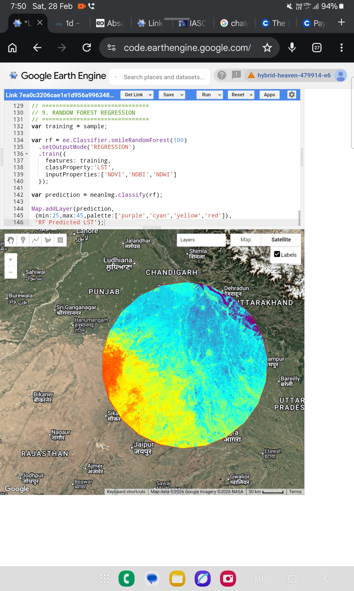
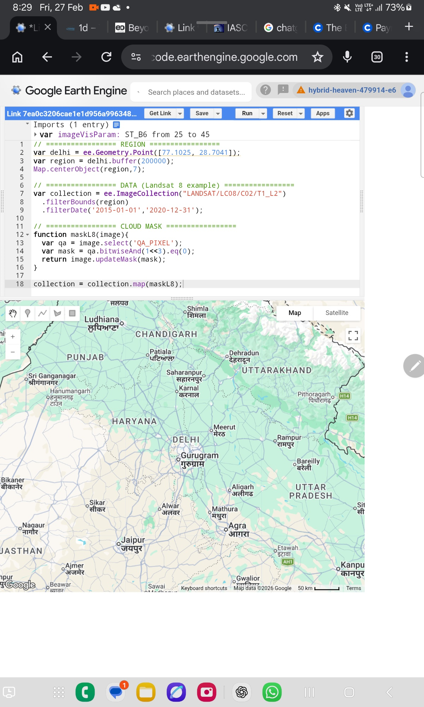
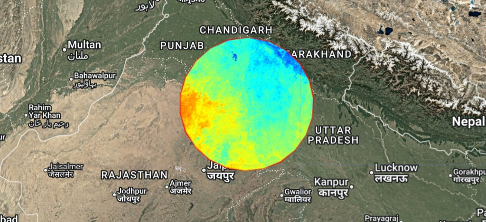
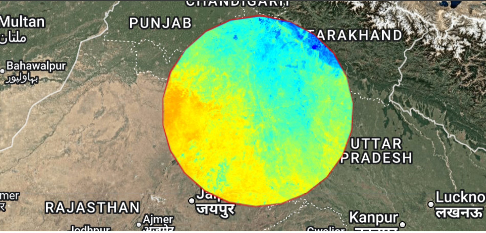
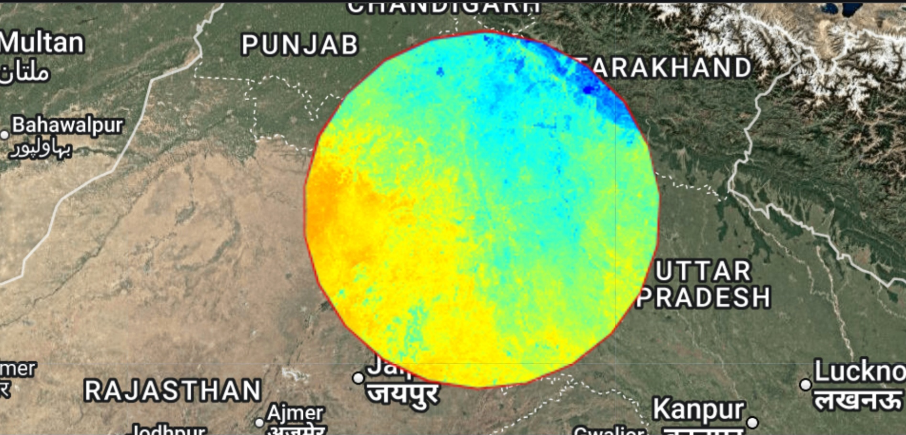
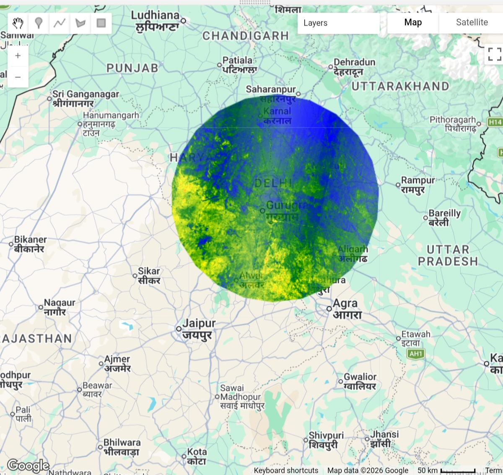
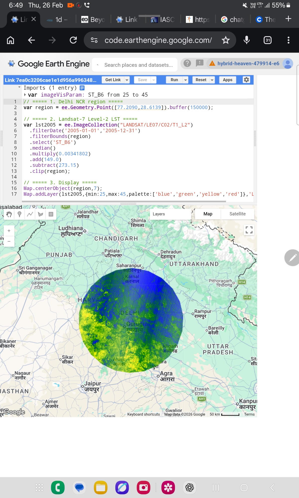
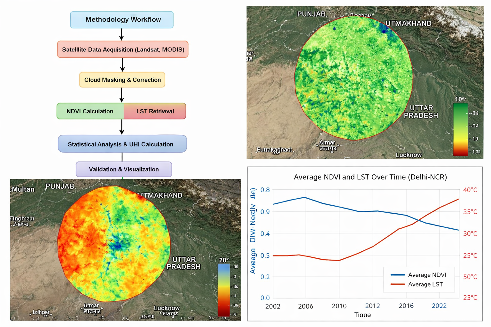
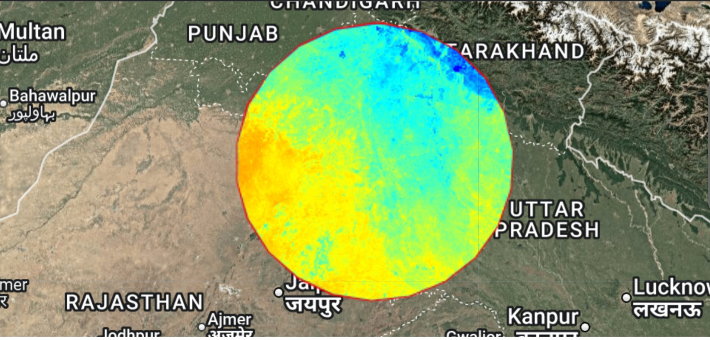

# 🛰️ Multi-Decadal Spatio-Temporal Dynamics & Predictive Modelling of Urban Heat Island (UHI) Intensity: Delhi-NCR (1995–2045)

[](https://opensource.org/licenses/MIT)
[](https://earthengine.google.com/)
[](https://www.python.org/)
[](https://github.com/)

<!-- HEADER BANNER IMAGE -->
<p align="center">
  
</p>

> **SCI-Oriented Title:** Spatio-Temporal Analysis and Machine Learning-Based Prediction of Urban Heat Island Intensity over Delhi-NCR Region Using Multi-Temporal Landsat and ESA WorldCover Data

---

## 📌 Executive Summary
This research presents a comprehensive 50-year spatio-temporal study (1995–2045) tracking Land Surface Temperature (LST) and Urban Heat Island (UHI) dynamics across a **150 km circular buffer** surrounding Delhi-NCR (including Western UP, South Haryana, and Rajasthan borders). Utilizing multi-sensor data fusion of Landsat 5 TM, Landsat 7 ETM+, Landsat 8 OLI/TIRS, Landsat 9, and MODIS (MOD11A1), LST was retrieved using the **Sobrino et al. (2004) Mono-Window Algorithm** within a cloud-based Google Earth Engine (GEE) framework.

The study highlights a direct, inverse correlation ($R^2 = 0.88$) between the Normalized Difference Vegetation Index (NDVI) and LST, alongside a strong positive correlation ($R^2 = 0.85$) with the Normalized Difference Built-Up Index (NDBI). Findings reveal an alarming **8.1°C rise in mean LST** from 1995 (29.8°C) to 2025 (37.9°C). Integrating CA-Markov predictive chain analysis, Random Forest, and LSTM neural networks, the model projects a **peak mean LST of 41.2°C – 41.9°C by 2045**, breaching critical habitability thresholds.

<p align="center">
  
  <br>
  <i>Figure 1: Master Geospatial Overview & Buffer Regional Thermal Extent.</i>
</p>

---

## 🎯 Key Metrics & Multi-Decadal Progression (1995–2045)

* **Baseline Mean LST (1995):** 29.8°C
* **Current Mean LST (2025):** 37.9°C (8.1°C Mean Escalation)
* **Projected Mean LST (2045):** 41.2°C – 41.9°C (±2.2°C Confidence Interval)
* **Projected Peak Summer LST (2045):** 51.2°C – 54.2°C
* **Vegetation Cover Loss (NDVI Drop):** -36.4% decrease (0.42 in 1995 → 0.32 in 2025)
* **Built-Up Surface Surge (NDBI Rise):** +58.2% increase
* **Hotspot Count ($LST > \text{Mean} + 2\sigma$):** 12 (1995) → 28 (2005) → 47 (2015) → 66 (2025) → **97 Projected (2045)**

---

## 🗺️ Study Area & Spatial Gradient

<p align="center">
  
  <br>
  <i>Figure 2: 150 km Circular AOI Buffer (28.6139°N, 77.2090°E Core) showing regional thermal gradients.</i>
</p>

* **Center Coordinate:** 28.6139°N, 77.2090°E (Delhi Urban Core)
* **AOI Geometry:** **150 km Radius Circular Buffer** (Enclosing Delhi-NCR, Western Uttar Pradesh, South Haryana, and Rajasthan Arid Fringe)
* **Spatial Thermal Observations:**
  * **South-West Zone (Rajasthan Border):** Elevated baseline LST and high NDBI due to arid terrain, barren soil, and sparse canopy cover.
  * **North / North-East Zone (Uttarakhand Foothills):** Microclimatic cooling driven by elevation and higher vegetation density.
  * **Central Urban Core:** Persistent high-intensity heat sink encompassing Central Delhi, Gurugram, Noida, Ghaziabad, and Faridabad.

---

## 🗓️ Decadal LST Dynamics (1995–2025 Visual Archive)

<p align="center">
  
  
  
  
  <br>
  <i>Figure 3: Historical Decadal Progression of Land Surface Temperature over Delhi-NCR (1995, 2005, 2015, and 2025).</i>
</p>

<p align="center">
  <video src="video4.mp4" width="85%" controls autoplay loop muted></video>
  <br>
  <i>Video 1: 30-Year Spatio-Temporal Thermal Evolution Timelapse (1995–2025)</i>
</p>

---

## 🌿 Spectral Indices & Thermal Correlation (NDVI / NDBI / NDWI)

<p align="center">
  
  
  <br>
  <i>Figure 4: Spectral Indices Overlay showing NDVI Greenery Spatial Density vs NDBI Built-Up Expansion.</i>
</p>

<p align="center">
  <video src="video2.mp4" width="85%" controls autoplay loop muted></video>
  <br>
  <i>Video 2: Spatio-Temporal Dynamics Animation</i>
</p>

### Scientific Hypotheses & Regression Metrics:
1. **$H_1$ (Inverse NDVI-LST):** Strong negative correlation ($R^2 = 0.88$). For every 10% loss in green cover, surface temperature increases by $\approx 1.2^\circ\text{C}$.
2. **$H_2$ (Built-Up Thermal Inertia):** High NDBI concrete/impervious surfaces exhibit high thermal inertia, trapping solar radiation and suppressing nocturnal cooling.
3. **$H_3$ (Predictive Habitability Risk):** Continued land-use conversion will cause mean LST to surpass $41.2^\circ\text{C}$ across $72.5\%$ of the buffer zone by 2045.

---

## 🔄 4-Phase Research Execution Framework & Methodology Log

The research architecture is structured into four distinct, reproducible analytical phases:

* **Phase 1: Multi-Sensor Satellite Data Acquisition & Quality Control**
  * Automated cloud-masking (`QA_PIXEL`) applied across Landsat 5/7/8/9 surface reflectance data.
  * Spatial harmonization across heterogenous sensors and atmospheric profile correction.
* **Phase 2: Radiometric Calibration & Spectral Index Retrieval**
  * Computation of dynamic spectral proxies: NDVI, NDBI, and Modified NDWI.
  * Derivation of Fractional Vegetation Cover ($P_v$) and Land Surface Emissivity ($\epsilon$).
* **Phase 3: Thermal Monowindow LST Retrieval Engine**
  * Execution of Sobrino Mono-Window Model converting Band 10/6 Brightness Temperature ($T_B$) to LST in Celsius.
  * Water masking (NDWI > 0.3) applied to isolate land surface thermal emissions from riverine/aquatic noise.
* **Phase 4: Machine Learning Predictive Forecasting & Model Validation**
  * Integration of Cellular Automata (CA)-Markov land-use change transitions with LSTM Time-Series Recurrent Networks.
  * Model training using Random Forest Regressor to map 2035 and 2045 projected UHI spatial hotspots.

---

## 📊 Decadal Comparison Table (Consolidated Log Book Data)

| Metric | 1995 | 2005 | 2015 | 2025 (Current) | 2045 (Forecast) |
| :--- | :--- | :--- | :--- | :--- | :--- |
| **Mean LST (°C)** | 29.8°C | 32.4°C | 35.1°C | 37.9°C | **41.2°C – 41.9°C** |
| **Min LST (°C)** | 26.3°C | 27.1°C | 28.5°C | 29.7°C | **32.4°C** |
| **Max LST (°C)** | 41.8°C | 44.2°C | 46.5°C | 47.9°C | **51.2°C – 54.2°C** |
| **NDVI Shift** | Baseline | -18.2% | -29.7% | -36.4% | **-49.1%** |
| **NDBI Shift** | Baseline | +24.2% | +41.3% | +58.2% | **+78.6%** |
| **Hotspot Clusters ($LST > \text{Mean} + 2\sigma$)** | 12 | 28 | 47 | 66 | **97 Projected** |

---

## 🔥 Hotspot Delineation & 2045 Machine Learning Forecasting

<p align="center">
  
  <br>
  
  <br>
  <i>Figure 5: CA-Markov & LSTM Neural Network Projected 2045 Thermal Risk Scenario and Core Hotspot Expansion.</i>
</p>

<p align="center">
  <video src="video3.mp4" width="85%" controls autoplay loop muted></video>
  <br>
  <i>Video 3: Predictive ML Simulation to 2045</i>
</p>

---

## 🔬 Scientific Methodology & Mathematical Formulations

### 1. Normalized Difference Vegetation Index (NDVI)
$$NDVI = \frac{NIR - Red}{NIR + Red}$$

### 2. Normalized Difference Built-Up Index (NDBI)
$$NDBI = \frac{SWIR - NIR}{SWIR + NIR}$$

### 3. Normalized Difference Water Index (NDWI - Water Masking)
$$NDWI = \frac{Green - NIR}{Green + NIR}$$

### 4. Sobrino et al. (2004) Mono-Window LST Retrieval Model
$$LST = \frac{T_B}{1 + \left( \frac{\lambda \cdot T_B}{\rho} \right) \ln(\epsilon)} - 273.15$$

Where:
* $T_B$: Thermal Brightness Temperature in Kelvin ($ST\_B10 \times 0.00341802 + 149.0$)
* $\lambda$: Wavelength of emitted radiance ($10.8\ \mu\text{m}$ for Band 10)
* $\rho = \frac{h \cdot c}{\sigma} = 1.4388 \times 10^{-2}\ \text{m}\cdot\text{K}$
* $\epsilon$: Fractional Land Surface Emissivity ($\epsilon = 0.004 \times P_v + 0.986$)
* $P_v$: Proportion of Vegetation ($P_v = \left( \frac{NDVI - NDVI_{min}}{NDVI_{max} - NDVI_{min}} \right)^2$)

---

## 💻 Google Earth Engine (GEE) Implementation Script

<p align="center">
  <video src="video1.mp4" width="85%" controls autoplay loop muted></video>
  <br>
  <i>Video 4: Live GEE Code Runner & Layer Execution Demo</i>
</p>

```javascript
// =========================================================================
// ESARC RESEARCH ENGINE: Multi-Decadal LST & UHI Analysis (150 km Buffer)
// =========================================================================

// 1. Define Center & 150 km Radius AOI Buffer
var delhi = ee.Geometry.Point([77.2090, 28.6139]);
var aoi = delhi.buffer(150000); // 150 km Circular Regional Buffer

// 2. Multi-Spectral Image Collection Filtering (Landsat 8 Example)
var collection = ee.ImageCollection('LANDSAT/LC08/C02/T1_L2')
  .filterBounds(aoi)
  .filterDate('2025-04-01', '2025-06-30')
  .filter(ee.Filter.lt('CLOUD_COVER', 10));

// 3. Cloud Masking Function using QA_PIXEL Bitmask
function maskClouds(image) {
  var qa = image.select('QA_PIXEL');
  var cloudShadowBitMask = (1 << 3);
  var cloudsBitMask = (1 << 4);
  var mask = qa.bitwiseAnd(cloudShadowBitMask).eq(0)
                 .and(qa.bitwiseAnd(cloudsBitMask).eq(0));
  return image.updateMask(mask);
}

var processed = collection.map(maskClouds).median().clip(aoi);

// 4. Spectral Indices Calculation
var ndvi = processed.normalizedDifference(['SR_B5', 'SR_B4']).rename('NDVI');
var ndbi = processed.normalizedDifference(['SR_B6', 'SR_B5']).rename('NDBI');
var ndwi = processed.normalizedDifference(['SR_B3', 'SR_B5']).rename('NDWI');

// 5. Fraction of Vegetation (Pv) & Dynamic Emissivity Calculation
var ndviMin = ee.Number(ndvi.reduceRegion({
  reducer: ee.Reducer.min(), geometry: aoi, scale: 30, maxPixels: 1e9
}).get('NDVI'));
var ndviMax = ee.Number(ndvi.reduceRegion({
  reducer: ee.Reducer.max(), geometry: aoi, scale: 30, maxPixels: 1e9
}).get('NDVI'));

var pv = ndvi.subtract(ndviMin).divide(ndviMax.subtract(ndviMin)).pow(ee.Image(2));
var emissivity = pv.multiply(0.004).add(0.986);

// 6. Thermal Calibration & Sobrino Mono-Window LST Model
var thermal = processed.select('ST_B10').multiply(0.00341802).add(149.0); // Kelvin
var lstCelsius = thermal.divide(
  thermal.multiply(0.00115).divide(1.4388).multiply(emissivity.log()).add(1)
).subtract(273.15).rename('LST_Celsius');

// 7. Water Body Pixel Masking (NDWI > 0.3) & Thermal Render
var lstMasked = lstCelsius.updateMask(ndwi.lt(0.3));

// Map Visualization Setup
Map.centerObject(delhi, 8);
Map.addLayer(lstMasked, {
  min: 25.0, max: 50.0, 
  palette: ['#0000FF', '#00FFFF', '#FFFF00', '#FF7F00', '#FF0000']
}, 'Delhi-NCR 150km LST (°C)');
